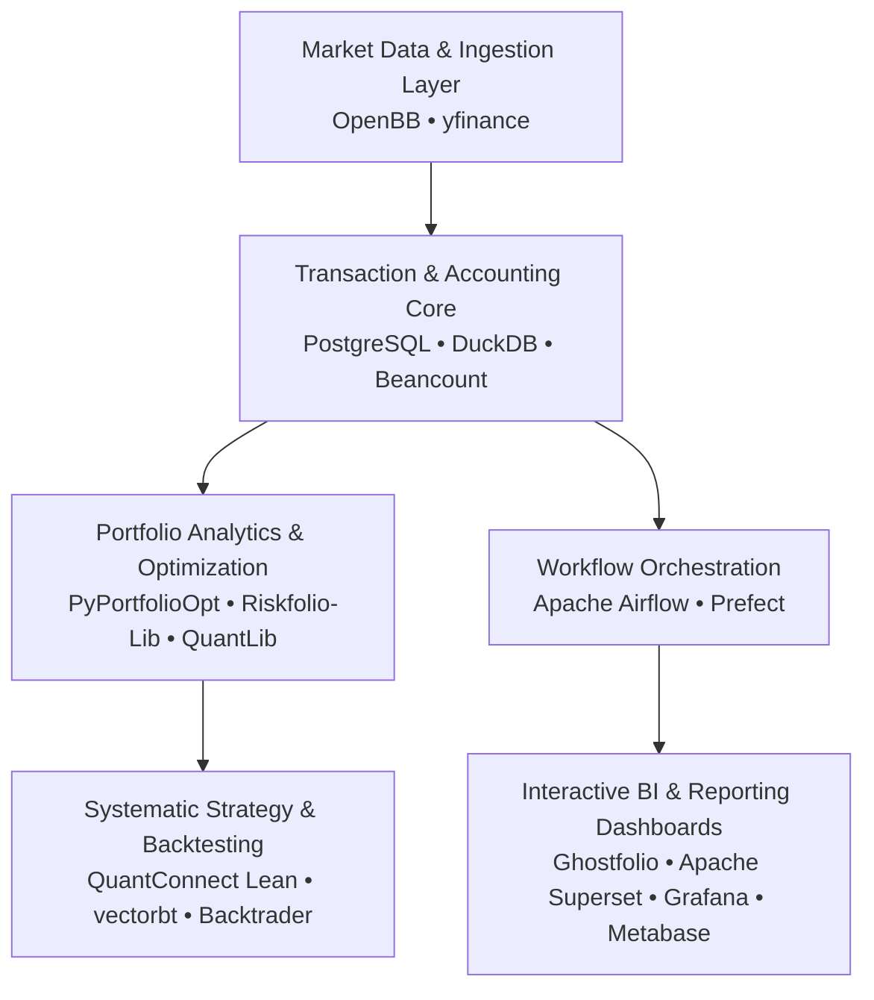

# 📊 Awesome Portfolio Management System (PMS) 🚀

  <b>A comprehensively curated directory of institutional SaaS platforms, open-source wealth trackers, portfolio accounting software, quantitative trading engines, and investment analytics libraries.</b>

Last updated: September 2026 • Curated with ❤️ for Wealth Managers, RIAs, Family Offices, Quant Researchers &amp; Self-Hosted Investors

---

## 📌 Table of Contents

- [🌐 Market Overview &amp; Industry Landscape](#-market-overview--industry-landscape)
- [💼 SaaS &amp; Hosted Platforms](#-saas--hosted-platforms)
- [⚡ Open-Source GitHub Projects](#-open-source-github-projects)
- [🧩 Modular Frameworks for Custom PMS Architecture](#-modular-frameworks-for-custom-pms-architecture)
- [🤝 How to Contribute](#-how-to-contribute)
- [📈 Star History](#-star-history)
- [⚠️ Disclaimer](#-disclaimer)

---

## 🌐 Market Overview &amp; Industry Landscape

> **Market Sizing &amp; Competitive Dynamics (2026):**
> The global **Wealth Management and Portfolio Management Software** sector is estimated at **$5.1B – $7.35B in 2026** (projected to reach over $15B by 2033 at a 13.5% CAGR). The market exhibits a **moderately fragmented, bifurcated structure**:
> - **Enterprise &amp; Institutional Tier:** Concentrated among heavyweight incumbents (BlackRock Aladdin, SimCorp, SS&C Advent, Envestnet, Addepar) leveraging deep multi-custodial integrations, regulatory compliance, and high switching costs.
> - **RIA, Mid-Market &amp; Independent Tier:** Highly fragmented and fiercely competitive across wealthtech platforms (Orion, Tamarac, Nitrogen, YCharts, Koyfin) and a rapidly expanding ecosystem of privacy-focused, self-hosted open-source software.

---

## 💼 SaaS &amp; Hosted Platforms

*Sorted in descending order by estimated company valuation / market capitalization / annual revenue.*

| 🏷️ Product | 🏢 Company Size &amp; Valuation / Revenue | 📝 Description | 💵 Starting Pricing | 🎁 Free Tier / Trial Limits |
| :--- | :--- | :--- | :--- | :--- |
| [**BlackRock Aladdin**](https://www.blackrock.com/aladdin) | **~$180B Market Cap** ($24.2B Revenue, $15.3T AUM) | Enterprise investment-management platform providing portfolio management, risk analytics, trading, operations, accounting, and investment technology capabilities. | Starting at ~$2,000,000–$8,000,000/year (institutional AUM tier) | No free trial for Aladdin enterprise suite (free standalone BlackRock Advisor Center tools for advisors) |
| [**Interactive Brokers PortfolioAnalyst**](https://www.interactivebrokers.com/en/trading/portfolioanalyst.php) | **~$163B Market Cap** ($6.2B Revenue) | Comprehensive portfolio analysis capability supporting consolidated multi-asset investment tracking, performance analysis, allocation reporting, and portfolio analytics. | Starting at $0/month (Free for all IBKR &amp; standalone non-IBKR accounts) | Free Forever: full performance attribution, multi-institution account aggregation, GIPS-verified reports, risk analytics with no paywalled tiers |
| [**SS&C Advent**](https://www.advent.com/) | **~$20.6B Market Cap** ($6.4B Revenue) | Investment-management software portfolio providing portfolio accounting (APX/Axys), wealth management (Black Diamond), fund administration, reporting, and trading. | Starting at ~$15,000–$25,000/year (Black Diamond / APX baseline) | No free tier or trial (sales-led product demo upon request) |
| [**Morningstar Direct**](https://www.morningstar.com/products/direct) | **~$9.2B Market Cap** ($2.4B Revenue) | Institutional investment research and portfolio analysis platform providing fund research, portfolio analytics, performance evaluation, risk analysis, benchmarking, and investment reporting. | Starting at $10,000–$17,500/year (1st user baseline) | 14-day free trial (requires professional contact request &amp; specialist walkthrough) |
| [**Envestnet**](https://www.envestnet.com/) | **~$4.5B Valuation** ($1.25B Revenue, Acquired by Bain Capital) | Wealth-management and investment platform supporting portfolio management, investment research, financial planning, managed accounts, data aggregation, and adviser technology. | Starting at $2,500/year (~$216.67/month for MoneyGuide planning; platform core at ~10–50 bps AUM) | No free tier or trial for enterprise platform (scheduled product demo available) |
| [**SimCorp One**](https://www.simcorp.com/) | **~$4.2B Valuation (€3.9B)** (Subsidiary of Deutsche Börse) | Institutional investment-management platform supporting front-to-back investment operations, portfolio management, accounting, risk management, and investment reporting. | Starting at ~$500,000–$1,000,000+/year (institutional scale via RFP) | No free tier or trial (enterprise demo &amp; RFP evaluation process) |
| [**Addepar**](https://addepar.com/) | **~$3.25B Valuation** ($230M Series G, $5T+ Assets Tracked) | Wealth and investment management platform focused on multi-asset portfolio aggregation, performance reporting, analytics, data management, and complex portfolio visibility. | Starting at ~$50,000/year (plus implementation fees) | No free tier or self-service trial (product demo upon request) |
| [**Orion**](https://orion.com/) | **~$2.5B–$3.0B Est. Valuation** ($6.6T Assets Administered) | Wealth-management technology platform providing portfolio accounting, investment management, reporting, financial planning, trading, and adviser workflow capabilities. | Starting at $13,000/year (Foundation Stack) | No free tier or trial for core platform (demo available; standalone Orion Academy &amp; pro bono tools free) |
| [**Allvue Systems**](https://allvuesystems.com/) | **~$2.0B–$3.0B Valuation** (Vista Equity Partners Portfolio) | Investment-management technology platform supporting portfolio management, investment accounting, structured finance, credit management, and alternative investments. | Starting at ~$25,000–$50,000/year (private equity &amp; credit fund baseline) | No free tier or trial (customized demo upon request) |
| [**Tamarac**](https://www.tamaracinc.com/) | **~$1.0B–$1.5B Est. Valuation** (Division of Envestnet) | Investment-management and portfolio-accounting platform for financial advisers, supporting portfolio reporting, rebalancing, trading, client portals, and performance management. | Starting at ~$10,000–$15,000/year (or ~$3,000/year base for standalone legacy reporting) | No free tier or trial (interactive demo available upon request) |
| [**Nitrogen**](https://nitrogenwealth.com/) | **~$500M–$750M Est. Valuation** (Formerly Riskalyze) | Wealth-management and investment-risk platform supporting portfolio analysis, client engagement, risk assessment, and financial adviser workflows. | Starting at $245/month per advisor (billed annually) | No free tier (guided firm demo and onboarding evaluation) |
| [**YCharts**](https://ycharts.com/) | **~$200M–$300M Est. Valuation** (~$30M ARR, LLR Partners) | Investment research and portfolio analytics platform providing market data, financial research, model portfolios, performance comparison, and visualization tools. | Starting at $3,600/year (Professional / Advisor tier) | 7-day free trial (full platform feature access, no credit card required) |
| [**Vestmark**](https://www.vestmark.com/) | **~$150M–$250M Est. Valuation** (~$73M Revenue) | Wealth-management technology platform focused on portfolio management, trading, rebalancing, managed accounts, and investment workflows. | Starting at ~$25,000–$50,000/year (or ~5–15 bps AUM for turnkey services) | No free tier or trial (live platform demo upon request) |
| [**Croesus**](https://www.croesus.com/) | **~$100M–$200M Est. Valuation** (~$35M–$68M Revenue) | Wealth-management technology platform providing portfolio management, investment reporting, client experience, financial planning, and adviser productivity tools. | Starting at ~$10,000–$25,000/year (institution-scale license baseline) | No free tier or trial (consultative demo available upon request) |
| [**FundCount**](https://fundcount.com/) | **~$50M–$100M Est. Valuation** (Private Family Office FinTech) | Integrated portfolio accounting and investment-management platform designed for family offices, investment managers, and complex multi-entity investment structures. | Starting at $14,450/year (Fund Admin Incubator tier, up to 5 funds &amp; 1 user) | No free trial (sandbox testing environment available starting at $499/month; live demo available) |
| [**Koyfin**](https://www.koyfin.com/) | **~$30M–$50M Est. Valuation** (~$4.3M ARR) | Investment research and market analytics platform providing portfolio monitoring, financial data, charting, screening, and investment analysis. | Starting at $0/month (Free forever); paid tiers start at $39/month (Plus) | Free Forever: max 2 watchlists, 2 screens, 2 custom dashboards, 2 years historical statements, 1 year analyst estimates, 5 alerts |
| [**AssetBook**](https://assetbook.com/) | **~$21.3M Est. Valuation** (~$3M Revenue) | Portfolio management and reporting platform supporting investment tracking, wealth reporting, asset aggregation, and financial visibility. | Starting at $400/month (~$43/account/year with volume breakpoints) | No free tier or trial (personalized workflow demo upon request) |
| [**Kubera**](https://www.kubera.com/) | **~$15M–$30M Est. Valuation** (Bootstrapped / Angel) | Wealth-tracking platform supporting aggregation of financial assets, investments, bank accounts, real estate, and other components of personal net worth. | Starting at $250/year (Essentials tier; Black tier at $2,500/year) | 14-day trial for $1 nominal commitment fee (full asset tracking and balance sheet access) |
| [**PortfolioCenter**](https://www.envestnet.com/) | **Legacy Enterprise Asset** (Envestnet / Schwab Legacy) | Portfolio accounting and management platform designed for investment advisers and wealth-management organizations, with reporting and investment-performance capabilities. | Starting at ~$3,000/year (base desktop/cloud module) | No free tier or trial (guided walkthrough/consultation upon request) |
| [**Captools**](https://www.captools.com/) | **Legacy Boutique PMS** (Desktop/VM Licensed Platform) | Investment portfolio management and accounting software supporting portfolio tracking, performance analysis, reporting, tax reporting, and investment record management. | Starting at $1,500/year (single-user desktop/VM license) | No free tier or trial (evaluations handled via direct sales inquiry) |

---

## ⚡ Open-Source GitHub Projects

*Sorted in descending order by GitHub stargazer count.*

| 🚀 Repository | 🌟 GitHub_Stars | 💻 Language / Stack | 📖 Description |
| :--- | :---: | :---: | :--- |
| [**Grafana**](https://github.com/grafana/grafana) |  | Go / TypeScript | The open and composable observability and data visualization platform. Widely used for building real-time investment dashboards, portfolio telemetry, asset allocation monitors, and financial metrics tracking. |
| [**Apache Superset**](https://github.com/apache/superset) |  | Python / TypeScript | Enterprise-grade business-intelligence web application for building self-hosted investment dashboards, portfolio reports, multi-asset performance analytics, and interactive client reporting interfaces. |
| [**pandas**](https://github.com/pandas-dev/pandas) |  | Python / Cython / C | Flexible and powerful data analysis and manipulation library. Serves as the industry-standard foundation for financial timeseries processing, portfolio return calculations, risk analytics, and tax-lot accounting. |
| [**Metabase**](https://github.com/metabase/metabase) |  | Clojure / TypeScript | Open-source analytics and BI platform suitable for creating interactive portfolio dashboards, investment reporting, allocation breakdowns, and business intelligence. |
| [**NumPy**](https://github.com/numpy/numpy) |  | Python / C | Fundamental package for scientific and numerical computing in Python, providing multidimensional array operations essential for quantitative portfolio models, covariance matrices, and risk simulations. |
| [**Apache Airflow**](https://github.com/apache/airflow) |  | Python | Programmatic workflow orchestration platform for scheduling market-data pipelines, nightly portfolio accounting valuations, transaction reconciliation, and automated reporting jobs. |
| [**OpenBB Platform**](https://github.com/OpenBB-finance/OpenBB) |  | Python | Investment research and financial data platform providing unified access to high-quality market data, macroeconomic indicators, equities, ETFs, crypto, and quantitative analysis tools. |
| [**Firefly III**](https://github.com/firefly-iii/firefly-iii) |  | PHP / JavaScript | Free and open-source self-hosted personal finance and asset management tool supporting multi-account tracking, transactions, budgets, balance sheets, liabilities, and financial reports. |
| [**DuckDB**](https://github.com/duckdb/duckdb) |  | C++ / SQL | High-performance in-process analytical database optimized for executing ultra-fast SQL queries on massive investment datasets, transaction histories, market tick feeds, and Parquet data lakes. |
| [**PostgreSQL**](https://github.com/postgres/postgres) |  | C / SQL | World's most advanced open-source relational database, serving as the standard reliable data store for holding transaction ledgers, securities master data, valuations, and audit logs. |
| [**SciPy**](https://github.com/scipy/scipy) |  | Python / C / C++ / Fortran | Open-source scientific computing library providing numerical optimization, root-finding, interpolation, and linear algebra routines fundamental to Modern Portfolio Theory and risk modeling. |
| [**Actual Budget**](https://github.com/actualbudget/actual) |  | TypeScript / Node.js | Fast, privacy-focused local-first personal finance system with double-entry accounting features that seamlessly complement personal wealth and investment tracking workflows. |
| [**yfinance**](https://github.com/ranaroussi/yfinance) |  | Python | Widely used Python library for downloading historical market prices, dividends, corporate actions, and fundamental data from Yahoo Finance for portfolio backtesting and valuation. |
| [**Ghostfolio**](https://github.com/ghostfolio/ghostfolio) |  | TypeScript / NestJS / Angular | Open-source, privacy-first wealth management and portfolio tracking web application for stocks, ETFs, and cryptocurrencies with multi-account support, allocation charts, and performance metrics. |
| [**QuantConnect Lean**](https://github.com/QuantConnect/Lean) |  | C# / Python | Professional algorithmic trading and quantitative portfolio research engine for portfolio construction, alpha factor research, backtesting, and systematic live execution across asset classes. |
| [**Backtrader**](https://github.com/mementum/backtrader) |  | Python | Mature, feature-rich Python backtesting and algorithmic trading framework for strategy development, multi-timeframe portfolio simulation, and trade analysis. |
| [**FinRL**](https://github.com/AI4Finance-Foundation/FinRL) |  | Python / PyTorch | Deep reinforcement learning framework for financial quantitative analysis, automated portfolio allocation, market making, and systematic trading strategy optimization. |
| [**vectorbt**](https://github.com/polakowo/vectorbt) |  | Python / Numba / NumPy | High-performance quantitative analysis library that vectorizes trading and portfolio backtesting using NumPy and Numba for lightning-fast hyperparameter scans and optimization. |
| [**Prefect**](https://github.com/PrefectHQ/prefect) |  | Python | Modern workflow orchestration engine designed for automating portfolio pipelines, financial API ingestion, scheduled NAV re-calculations, and report generation. |
| [**GnuCash**](https://github.com/Gnucash/gnucash) |  | C / C++ / Scheme | Mature, open-source personal and small-business double-entry accounting software with native support for investment portfolios, stock tracking, mutual funds, and detailed balance sheets. |
| [**Portfolio Performance**](https://github.com/buchen/portfolio) |  | Java / Eclipse RCP | Mature desktop investment portfolio management application supporting multi-currency accounts, automated quote retrieval, performance metrics (TTWROR, IRR), and asset allocation. |
| [**Zipline**](https://github.com/quantopian/zipline) |  | Python / C | Event-driven algorithmic trading engine originally developed by Quantopian, providing order simulation, portfolio risk tracking, transaction cost models, and historical backtesting. |
| [**QuantLib**](https://github.com/lballabio/QuantLib) |  | C++ / Python / Java | Comprehensive quantitative finance framework supporting derivatives pricing, yield curve modeling, fixed income valuation, Monte Carlo simulations, and risk analytics. |
| [**statsmodels**](https://github.com/statsmodels/statsmodels) |  | Python / Cython / C | Statistical estimation and econometric modeling library providing regression models, time series analysis (ARIMA, VAR), factor decomposition, and portfolio risk attribution. |
| [**rotki**](https://github.com/rotki/rotki) |  | Python / TypeScript / Vue.js | Open-source, privacy-first portfolio tracker, accounting, and analytics application with extensive support for crypto assets, DeFi protocols, exchange accounts, and on-chain histories. |
| [**PyPortfolioOpt**](https://github.com/robertmartin8/PyPortfolioOpt) |  | Python | Financial portfolio optimization library supporting Markowitz Efficient Frontier, Black-Litterman allocation, Hierarchical Risk Parity (HRP), risk models, and discrete allocation. |
| [**Beancount**](https://github.com/beancount/beancount) |  | Python / C | Double-entry plain-text accounting system optimized for investment transaction tracking, lot tracking, capital gains calculation, and automated balance reconciliation. |
| [**Wealthfolio**](https://github.com/afadil/wealthfolio) |  | Rust / TypeScript / Tauri | Local-first, private desktop investment portfolio manager for tracking multi-asset net worth, investment performance, dividend cash flows, and retirement forecasts. |
| [**Fava**](https://github.com/beancount/fava) |  | Python / TypeScript / Svelte | Beautiful, responsive web interface for Beancount providing interactive financial charts, balance sheet inspection, income statements, and portfolio lot breakdowns. |
| [**Ledger**](https://github.com/ledger/ledger) |  | C++ / Python | Powerful command-line double-entry accounting tool designed for recording financial transactions, investment purchases, cost basis, currency conversions, and audit reports. |
| [**Riskfolio-Lib**](https://github.com/dcajasn/Riskfolio-Lib) |  | Python | Comprehensive library for portfolio optimization and quantitative risk analysis, supporting 24+ risk measures (VaR, CVaR, EVaR, CDaR), worst-case allocation, and factor models. |
| [**hledger**](https://github.com/simonmichael/hledger) |  | Haskell | Cross-platform, reliable plain-text accounting software for tracking money, investments, commodities, and capital gains with fast terminal and web interfaces. |
| [**Pyfolio**](https://github.com/quantopian/pyfolio) |  | Python | Quantitative portfolio performance and risk analysis library generating comprehensive tear sheets with Sharpe, Sortino, drawdowns, factor exposures, and Bayesian analysis. |
| [**Money Manager Ex**](https://github.com/moneymanagerex/moneymanagerex) |  | C++ / wxWidgets | Free, open-source, cross-platform personal finance and investment tracking application supporting stocks, mutual funds, asset accounts, and recurring transactions. |
| [**Alphalens**](https://github.com/quantopian/alphalens) |  | Python | Performance analysis tool for predictive alpha factors in quantitative investing, assessing information coefficient (IC), turnover, and quantile returns. |
| [**empyrical**](https://github.com/quantopian/empyrical) |  | Python | Financial risk and performance analytics library providing optimized computation of Sharpe ratio, Sortino, Alpha, Beta, Calmar, Max Drawdown, and Value at Risk. |
| [**ffn**](https://github.com/pmorissette/ffn) |  | Python | Financial performance analysis library for Python that provides performance tear sheets, rebalancing logic, drawdown tables, and return benchmarking. |
| [**OpenGamma Strata**](https://github.com/OpenGamma/Strata) |  | Java | Open-source analytics library for market risk, pricing, scenario analysis, and trade valuation across derivatives, fixed income, and institutional portfolios. |
| [**bt**](https://github.com/pmorissette/bt) |  | Python | Flexible Python framework for building, testing, and evaluating quantitative trading and portfolio allocation algorithms based on a tree structure of reusable algos. |
| [**LibreFolio**](https://github.com/librefolio/librefolio) |  | Rust / TypeScript / Svelte | Modern self-hosted open-source financial portfolio tracker for investments, multi-broker cash accounts, and loans with automated pricing, FX conversion, and cost-basis analysis. |
| [**QSTrader**](https://github.com/mhallsmoore/qstrader) |  | Python | Event-driven backtesting and live execution engine designed for systematic trading strategies, portfolio construction, position sizing, and rebalancing simulations. |
| [**PyFolio Reloaded**](https://github.com/stefan-jansen/pyfolio-reloaded) |  | Python | Actively maintained fork of Pyfolio supporting modern Python/pandas versions for generating comprehensive portfolio risk and return tear sheets. |
| [**PortfolioLab**](https://github.com/hudson-and-thames/portfoliolab) |  | Python | Research and implementation toolkit providing modern portfolio construction, Hierarchical Clustering Asset Allocation (HCAA), nested clustered optimization, and risk metrics. |
| [**mlfinlab**](https://github.com/hudson-and-thames/mlfinlab) |  | Python | Machine learning and quantitative finance package implementing methods from Marcos López de Prado's books for financial data labeling, feature engineering, and bet sizing. |
| [**Portfolio Tracker**](https://github.com/ananthvk/portfolio) |  | Python / Flask | Clean self-hosted transaction-based investment tracker supporting multi-currency holdings, asset allocation, target weight rebalancing, and historical performance tracking. |
| [**Local Investment Tracker**](https://github.com/vigneshshettyin/Local-Investment-Portfolio-Tracker) |  | Python / Streamlit | Self-hosted dashboard for tracking stocks, ETFs, mutual funds, commodities, cryptocurrencies, and fixed deposits with live pricing and interactive charts. |
| [**FinFolio Tracker**](https://github.com/t3rm1n4l/finfolio) |  | Go / SQLite | Privacy-first Indian portfolio manager supporting mutual funds, stocks, fixed deposits, sovereign gold bonds, EPF/PPF, NPS, real estate, and insurance policies. |
| [**Moneyman**](https://github.com/mowen/moneyman) |  | Go / Vue.js | Lightweight self-hosted personal portfolio tracker and asset allocation management tool for monitoring investment distribution across brokers. |

---

## 🧩 Modular Frameworks for Custom PMS Architecture

When designing a production-grade custom or self-hosted Portfolio Management System, you can assemble best-of-breed open-source components across each functional architectural tier:

- **Portfolio UI &amp; Web Dashboards:** [Ghostfolio](https://github.com/ghostfolio/ghostfolio), [Wealthfolio](https://github.com/afadil/wealthfolio), [LibreFolio](https://github.com/librefolio/librefolio), or [Portfolio Performance](https://github.com/buchen/portfolio).
- **Persistent Financial Databases:** [PostgreSQL](https://github.com/postgres/postgres) (relational ledger &amp; audit trails), [DuckDB](https://github.com/duckdb/duckdb) (vectorized OLAP analytics).
- **Market Data Feeds:** [OpenBB Platform](https://github.com/OpenBB-finance/OpenBB), [yfinance](https://github.com/ranaroussi/yfinance).
- **Portfolio Accounting &amp; Lot Tracking:** [Beancount](https://github.com/beancount/beancount), [Fava](https://github.com/beancount/fava), [Ledger](https://github.com/ledger/ledger).
- **Asset Allocation &amp; Optimization:** [PyPortfolioOpt](https://github.com/robertmartin8/PyPortfolioOpt), [Riskfolio-Lib](https://github.com/dcajasn/Riskfolio-Lib), [PortfolioLab](https://github.com/hudson-and-thames/portfoliolab).
- **Quantitative Research &amp; Trading Execution:** [QuantConnect Lean](https://github.com/QuantConnect/Lean), [vectorbt](https://github.com/polakowo/vectorbt), [Backtrader](https://github.com/mementum/backtrader), [Zipline](https://github.com/quantopian/zipline).
- **Performance &amp; Risk Tear Sheets:** [Pyfolio Reloaded](https://github.com/stefan-jansen/pyfolio-reloaded), [empyrical](https://github.com/quantopian/empyrical), [ffn](https://github.com/pmorissette/ffn), [statsmodels](https://github.com/statsmodels/statsmodels).
- **Workflow &amp; ETL Automation:** [Apache Airflow](https://github.com/apache/airflow), [Prefect](https://github.com/PrefectHQ/prefect).
- **Business Intelligence &amp; Client Reporting:** [Apache Superset](https://github.com/apache/superset), [Metabase](https://github.com/metabase/metabase), [Grafana](https://github.com/grafana/grafana).

---

## 🤝 How to Contribute

Contributions are welcome! Please follow these steps to contribute:

1. 🍴 **Fork the repository** on GitHub.
2. 🌿 **Create a new branch** for your addition (`git checkout -b add-awesome-tool`).
3. 📝 **Add/edit entries in [README.md](file:///C:/Users/hp/Documents/Projects/Awesome-Portfolio-Management-System/README.md)** (maintain alphabetical or sorted order, provide 1–2 factual sentences, specify tier pricing &amp; free tier limits, and include the official GitHub star badge linking to its `/stargazers` page).
4. 🚀 **Submit a Pull Request** with a clear explanation of why the tool is valuable to the PMS ecosystem.
5. ⭐ **Star this repository** if you found it useful!

---

## 📈 Star History

---

## ⚠️ Disclaimer

- This is a community-curated directory and should not be construed as investment, legal, tax, or professional financial advice.
- Automated portfolio optimization algorithms and analytics tools can contain model assumptions, calculation approximations, or data delays.
- Historical investment performance does not guarantee future financial returns.
- Always validate tax-lot treatments, corporate actions, and regulatory compliance before executing financial decisions.
- Self-hosted open-source software deployments require appropriate encryption, backups, and security configurations to protect private financial data.

---

  Maintained by <a href="https://github.com/ishandutta2007">Ishan Dutta</a> • Let's make portfolio management more transparent, accessible, and data-driven! 🌟

